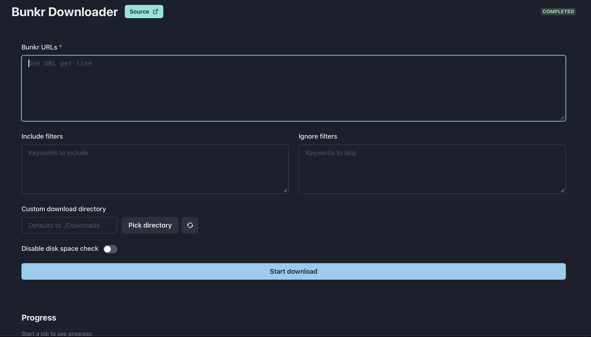

# BunkrDownloader

Rich CLI + web dashboard for grabbing albums and files from Bunkr with resilient retries, live progress, and container-ready deployment.



> **If you find this project useful, please consider giving it a star on GitHub! ⭐**

## Table of Contents
- [BunkrDownloader](#bunkrdownloader)
  - [Table of Contents](#table-of-contents)
  - [Highlights](#highlights)
  - [Quick Start](#quick-start)
    - [With Docker Compose (recommended)](#with-docker-compose-recommended)
      - [Common Operations](#common-operations)
      - [Environment Variables](#environment-variables)
    - [Local runtime](#local-runtime)
  - [CLI Usage](#cli-usage)
  - [Web Dashboard](#web-dashboard)
  - [Configuration](#configuration)
  - [Architecture](#architecture)
  - [Development](#development)
  - [Contributing](#contributing)
  - [Support \& Issues](#support--issues)
  - [Forked credits](#forked-credits)
  - [License](#license)
  - [Star History](#star-history)

## Highlights
- **Dual experience**: Python CLI (`downloader.py`, `main.py`) or a Chakra UI dashboard powered by FastAPI.
- **Realtime feedback**: Rich terminal UI and a websocket + polling hybrid on the web keep progress/logs alive, even after restarts.
- **Maintenance detection**: Real-time status page checks detect server maintenance and apply intelligent retry strategies with longer delays or skip affected files.
- **Smart filtering**: Include/ignore rules, disk-space guard, filename sanitisation, and album pagination handled automatically.
- **Configurable storage**: Point downloads to any folder (CLI `--custom-path` or web directory picker) with existing files skipped safely.
- **Container friendly**: Multi-stage Docker image, docker-compose stack, and CI pipeline for publishing multi-arch images to GHCR.

## Quick Start

### With Docker Compose (recommended)

This is the easiest way to run BunkrDownloader. You'll need [Docker Desktop](https://www.docker.com/products/docker-desktop/) installed on your machine (or Docker Engine + Compose on Linux).

1.  **Prepare configuration**:
    Create a `.env` file to customize your settings.
    ```bash
    cp .env.sample .env
    ```
    *Windows users: You can copy and rename the file in File Explorer.*

2.  **Customize (Optional)**:
    Open `.env` in a text editor to change where files are saved (`DOWNLOADS_DIR`) or which port to use (`API_PORT`).

3.  **Start the application**:
    Run the following command to download the image and start the service in the background:
    ```bash
    docker compose up -d
    ```

    Once running, open [http://localhost:8000](http://localhost:8000) in your browser.

#### Common Operations
- **Stop**: `docker compose down`
- **Updates**: Run `docker compose pull` followed by `docker compose up -d` to switch to the latest version.
- **Logs**: `docker compose logs -f` (Ctrl+C to exit).

#### Environment Variables

You can configure the deployment by setting the following environment variables in your `.env` file.

| Variable | Description | Default Value |
| :--- | :--- | :--- |
| `API_PORT` | The host port to access the Web UI and API. | `8000` |
| `API_HOST` | The host address the application listens on. | `0.0.0.0` |
| `DOWNLOADS_DIR` | The local directory where files will be saved. | `./Downloads` |
| `LOGS_DIR` | The local directory where logs will be stored. | `./logs` |
| `SESSION_LOG_PATH`| The internal path for the session log. | `/app/logs/session.log` |
| `IMAGE_TAG` | The Docker image version tag to use (e.g., `latest` or `1.2.3`). | `latest` |
| `UID` | The user ID to run the container as. | `1000` |
| `GID` | The group ID to run the container as. | `1000` |
| `STATUS_CHECK_ON_FAILURE` | Enable real-time status page checks on download failures. | `true` |
| `STATUS_CACHE_TTL_SECONDS` | Cache duration for status page results in seconds. | `60` |
| `MAINTENANCE_RETRY_STRATEGY` | Strategy for maintenance: `backoff` (retry with delays) or `skip` (log and skip). | `backoff` |

Set `IMAGE_TAG` to a published semantic version (for example `1.2.3`) if you want to pin a specific release; otherwise `latest` is used.

### Local runtime
```bash
# Backend
pip install -r requirements.txt
uvicorn src.web.app:app --reload

# Frontend (optional live dev server)
cd frontend
npm install
npm run dev
```
The Vite dev server proxies API/WebSocket traffic to `http://localhost:8000` by default. Run `npm run build` once to bake a production bundle served by FastAPI.

## CLI Usage
```bash
# Single URL
python3 downloader.py <bunkr_url> [--include term ...] [--ignore term ...] [--custom-path /path] [--disable-ui] [--disable-disk-check] [--skip-status-check] [--maintenance-strategy backoff|skip] [--status-cache-ttl SECONDS]

# Batch mode (URLs.txt)
python3 main.py [shared flags]
```
- `--include` downloads files containing any supplied substring.
- `--ignore` skips files containing any supplied substring.
- `--custom-path` points downloads to `<path>/Downloads`.
- `--disable-ui` swaps the Rich interface for plain logging (useful in notebooks/CI).
- `--skip-status-check` disables real-time status page checks on download failures (defaults to enabled).
- `--status-cache-ttl SECONDS` controls cache duration for status page results (default: 60s).
- `--maintenance-strategy backoff|skip` chooses retry behavior: `backoff` retries with longer delays (2min, 5min, 10min), `skip` logs and skips maintenance files.

## Web Dashboard
- **Job launcher** – paste URLs, set filters, toggle the disk check, or choose a custom destination via the directory browser.
- **Progress panes** – overall progress + per-file stripes; tooltips explain each control and metric.
- **Live log** – chronological events, retries, and skips with full timestamps.
- **Resilient updates** – when a WebSocket drops (e.g. container restart) the UI polls `/api/downloads/{job}/events` until the socket reconnects.
- **Source shortcut** – in-app link to the GitHub repository for quick reference.
- **Version badge** – header shows the semantic version embedded in the running container image.

## Configuration
- `.env` (tracked example) controls container defaults: `API_HOST`, `API_PORT`, `DOWNLOADS_DIR`, plus Vite proxy hints (`VITE_*`).
- Web UI tooltips describe every form element; hover to see accepted formats and side effects.
- Downloads default to `Downloads/` in the working directory unless `custom_path` (CLI) or the directory picker overrides it.
- `session.log` persists problematic URLs so you can retry them later. Maintenance events are logged with format: `[MAINTENANCE] timestamp | subdomain | status | url`.

## Architecture
- `downloader.py` / `main.py` call `validate_and_download`, which builds a `SessionInfo` and streams progress via `LiveManager`.
- `src/web/app.py` wraps the same flow: `JobEventBroker` buffers events, `WebLiveManager` mirrors CLI progress/log calls, and FastAPI exposes REST + WebSocket endpoints.
- `src/crawlers/*` resolve album pagination, decrypt media URLs, and normalise filenames.
- `src/downloaders/*` handle concurrency, retries, and chunked writes through `download_utils.save_file_with_progress`; subdomain outages are tracked with `bunkr_utils`.
- **Maintenance detection**: `bunkr_utils.refresh_server_status` checks Bunkr's status page on download failures with TTL-based caching. Failed downloads are grouped by subdomain and rechecked before final retries.
- `frontend/src/App.jsx` consumes `/api/downloads`, `/api/directories`, `/ws/jobs/{id}`, and the `/api/downloads/{id}/events` polling fallback for seamless updates. Maintenance events trigger toast notifications.

## Development
- Python ≥ 3.10, Node ≥ 18 recommended.
- Activate the virtualenv and lint with `python -m pylint $(git ls-files '*.py')`; resolve any findings before committing.
- Run `python -m compileall src` and `npm run build` before opening a PR to catch syntax/bundle issues.
- `docker compose up --build` exercises the full stack locally using the tracked `.env`.
- Use `session.log` and the web log pane to inspect failed URLs or storage issues.

## Contributing
- Start with the guidelines in `CONTRIBUTING.md` for branching, linting, and smoke-test expectations.
- Prefer [Conventional Commits](https://www.conventionalcommits.org/) (`feat:`, `fix:`, `docs:`, etc.) so semantic-release can generate changelogs correctly.
- Include the manual checks you ran (lint, `compileall`, `npm run build`, CLI/Web smoke tests) in your pull request description.
- Keep your branch rebased on `main` and respond quickly to review feedback to keep the release pipeline flowing.

## Support & Issues
- Open a new issue from the repository’s **Issues → New issue** page; choose the **Bug report** template for defects or the **Feature request** template for enhancements.
- The templates collect environment details (OS, Python version, tool version) and walk you through logs, reproduction steps, and desired outcomes so maintainers can triage quickly.
- Always confirm you’re running the latest release from [GitHub Releases](https://github.com/tekgnosis-net/BunkrDownloader/releases) and search for duplicates before filing.
- Blank issues are disabled, so pick the template that’s closest to your situation and use the “Additional context” field to capture anything extra.

## Forked credits
This project is a fork of [Lysagxra/BunkrDownloader](https://github.com/Lysagxra/BunkrDownloader). However, it has been heavily refactored and modified for a web dashboard interface and other enhancements including dockerizing the application.

## License
MIT License © tekgnosis-net

## Star History

[](https://star-history.com/#tekgnosis-net/BunkrDownloader&Date)
